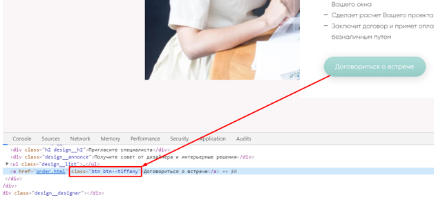

<h1>Инструкция по внесению правок на сайт Shtory-Shtory</h1>
<h2>Общая информация</h2>
Сайт состоит из 3 страниц – Главная (index.html), Портфолио (portfolio.html) и Заказ (order.html) с одинаковыми шапкой (header) и подвалом (footer). Между блоками <header> и <footer> лежит блок <main>, где находится основное содержимое каждой страницы.
Создание новой страницы
На данный момент для создания новой страницы необходимо скопировать любую из существующих, заменить ее имя, удалить содержимое 

 и далее внести свою верстку внутрь div class=”wrapper”. 

Внутри div class=”wrapper” находятся отдельные section. Каждый section – это отдельный логический блок страницы. Например, на главной страницы есть следующие section:

 
Если на новой создаваемой странице есть похожий блок, например, на блок «О нас» – слева текст с заголовком в рамке, можно взять <section id="about" class="about"></section> с главной страницы и просто заменить внутри текст и картинку. Если не убирать классы, то стили автоматически применятся к новой созданной секции.
<h2>Изменение стилей</h2>
Сайт написан на препроцессоре SASS – профессиональном расширении css, которое делает написание стилей более удобным и легко поддерживаемым. Однако браузер понимает только классический css, поэтому после каждого изменения стилей приходится компилировать sass в css. Это легко сделать с помощью программы Koala, скачать можно с официального сайта. После установки откроется следующее окно:

 
Перетаскиваем папку с проектом и проверяем настройки. Активным должен быть только блок sass и в нем должен стоять правильный путь, куда будет компилироваться готовый css файлик. Изменить путь можно, кликнув по иконке карандаша. Сделать активными/неактивными блоки можно кликом по блоку и установкой / снятием галочки «Автокомпиляция» во всплывающем справа окне. Активным оставляем только блок sass (галочка «Автокомпиляция» стоит), остальные должны быть неактивными (галочка «Автокомпиляция» отключена). Должна получится следующая картина:

 
Далее настраиваем правила компиляции SASS как на скриншоте:

 
Нажимаем кнопку Compile, если все прошло успешно, увидим следующее сообщение:

 
Позже нажимать эту кнопку будет необязательно, программа настроена так, что при сохранении измененного файла в редакторе кода компиляция и обновление файла css происходит автоматически.
Если все успешно собралось, переходим к редактированию. У SASS для простых целей очень простой синтаксис (если речь не идет, например, о написании миксина, там синтаксис немного непривычен по сравнению с обычным css). От классического css SASS отличается отсутствием фигурных скобок, точек с запятой в конце каждой строки и возможностью вкладывать селекторы друг в друга.
Посмотрим, на примере конкретной задачи, например, требуется сделать все основные заголовки с классом h1 на сайте больше. Находим файлик _global.sass внутри папки sass. В этом файлике собраны ключевые стили, которые применяются на всех страницах, для остальных блоков файлы sass называются в соответствии со смыслом блока, для форм – _forms.sass, для преимуществ – _advantages.sass и т.д. Здесь нужно понимать, что в _form.sass задаются стили для всех форм на сайте, а если на странице Портфолио формы немного отличаются, то единые стили будут в в _form.sass, а их небольшие корректировки уже в _portfolio.sass или в файле, отвечающим за блок с формой на странице Портфолио.
Смотрим _global.sass и находим .h1. Меняем значение font-size, не забывая поменять его и для media-запроса, если требуется увеличение заголовков и на мобильном.

 
Ниже запись «&--homepage» будет скомпилирована в h1--homepage, правило с этим селектором корректирует цвет заголовка на главной странице, так как в десктопе на всех страницах он белый, а на главной – розовый.
<h2>Если SASS не компилируется</h2>
Если этот подход по каким-то причинам не работает, можно просто добавить в папку css новый файлик с расширением css в папку css и подключить его в шапке на каждой странице вставкой следующего тега:
link rel="stylesheet" href="./css/filename.css"
Он должен быть подключен после подключения bundle.min.css – по правилам css стили написанные ниже переопределяют стили написанные выше. Переопределение понадобится в том случае, если менеджер сайта захочет написать не новые стили, а изменить существующие, например, сделать все заголовки на сайте больше.
<h2>Общая логика использования классов</h2>
Классы помогают одновременно стилизовать разные элементы и блоки на разных страницах, которые имеют конкрентный класс. Поэтому для тех блоков, которые уже имеются на сайте, например, заголовок или кнопка нежелательно создавать новые классы. Например, для большинства кнопок на сайте задано минимум 2 сайта – btn и класс-модификатор, например, btn--tiffany для кнопки цвета tiffany:

 
Класс btn описывает свойства всех кнопок, класс btn--tiffany дополняет или видоизменяет его, например, btn определяет цвет фона кнопки как белый, а btn--tiffany корректирует его:

 
Соответственно, если требуется добавить новую зеленую кнопку на новой или существующей странице, лучше не писать новые классы, а воспользоваться классами btn и btn--tiffany, это нужно для того, чтобы в будущем была возможность оперативно изменить один из существующих классов, и все кнопки с ними обновятся.
Если же требуется создать новую кнопку, например, розовую, то можно описать новый класс btn--pink и указать в нем background-color: #FF1493 (или любой код розового цвета), а к новой кнопке применить оба класса – и btn (чтобы кнопка забрала все, что описано в btn – размер и толщину шрифта, скругление по бокам, высоту и т.д., и btn—pink (чтобы цвет фона изменился на розовый).
